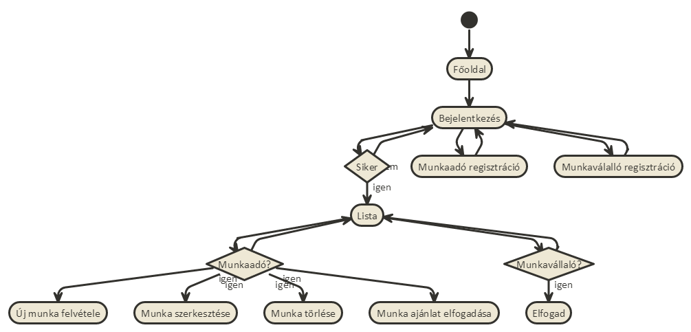
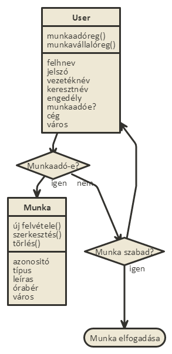

# Beadando
<h1>Alkalmazások fejlesztése első beadandó</h1>

<h3>Késíztette: Lévai András</h3>
<h5>Nemptun: AGY276</h5>
<h5>email: levaiandrass@gmail.com</h5>

<h6>1.  Követelmény analízis</h6>
        Alkalmazások fejlesztése órára egy olyan programot kellett készíteni mely a node js-t 
    felhasználva képes adatokat tárolni, új adatokat felvinni, meglévőket szerkeszteni 
    vagy törölni azokat. 
        Elvárás volt még egy autentikációs folyamat is, melyben egy regisztrált személy
    csak akkor haszánlhatja  programot/léphet be az oldalra, ha adatai megfelelnek
    és szerepel az adatbázisban.

<h6>2.  A feladat implementálása</h6>
        Egy munkakereső oldalt hoztam létre, melyet használhatunk munkavállaló és munkaadóként. 
    Mint munkaadók, képesek vagyunk új munkákat regisztrálni, a meglévőket módosítani vagy 
    törölni azokat.
        Mind munkavállalók, böngészehtünk a posztolt munkák között és elfogadhatjuk azokat,
        majd ha a munkavállaló is jóváhagyta, be is tölthetjük a kínált pozíciót.
    
<h6>3. Használati útmutató</h6>
        Mikor először megnyitjuk az oldalt, a főoldal fogad. Itt a jobb felső sarokan 
    kattinthatunk a bejelentkezésre, ami átírányít minket a következő oldalra.
    
        Ha még nem vagyunk regisztrálva, úgy itt eldönthetjük milyen szerepkörbe
    szeretnénk csatlakozni az oldalhoz. Két gomb áll a rendelkezésünkre 
    "Munka vállaló rgisztráció" és "Munkaadó regisztáció". Regisztráció 
    folyamán az elvárt információk a felhasználó név, jelsó, vezetéknév 
    és keresztnén. Emelett a munkaadóknak lehetőségük van cégként is beregisztrálni
    és székhelyük városát is megadni, de ez csak opcionális elvárás.
    
        Ha megtörtént a regisztráció, úgy bejeltnekezve a belső főoldal fogad
    minket, melyen a feladott munkák listáját láthatjuk. Ha munkavállalóként
    léptünk be, itt csak arra van lehetőségünk hogy böngésszünk a munkák között 
    és ha találunk számunkra szimpatikusat, amely szabad is, úgy arra 
    regisztrálhatjuk magunkat.
        Ha munkaadóként vagyunk jelen az oldalon, alkalmunk nyílik új munka
    felvételére, vagy ha már korábban adtunk fel munkát, azt szerkezhetjük,
    törölhetjük vagy ha jelentkezett rá már munkavállaló úgy el is fogadhatjuk
    a jelentkezését. Természetesen más által feladott munkát nem módosíthatjuk
    valamint el sem fogadhatunk munkát, azt csak munkavállalók tehetik. 
        Új munka felvételekor meg kell adnunk a várost, amelyben a munkát hir-
    detjük, a típusát, mint például fizikai vagy irodai, egy rövid leírást a 
    munkáról, legvégül pedig az órabért. Miután feladtuk a munkát, szerkezhetjük
    utólag is ezeket a paramétereket.
    
<h6>4. Tesztelés</h6>
        A programban jelenleg három előre meghatározott felhasználó van regisztrálva,
    emelett három munka van felvéve, státusz zserint különbözől (betöltött, döntésre vár,
    szabad). Az első felhasználó (felhnév.: 1 jelszó: 1) munka vállalóként van regisztrálva.
    A második (felhnév.: 2 jelszó: 2) munkaadóként, hozzátartozik az utolsó két munka.
    A harmadik (felhnév.: 3 jelszó: 3) is munkaadó, hozzá tartozik az első munka.
        Természetesen a felhasználó maga is létrehozhat új felhasználókat.
        Fejlesztői környezetben a "munkaado.tes.js" tesztelte új munkaadó és munkavállaló
    felvételét. A "zombi.test.js" pedig a honlap felépítését ellenőrizte. Ezekhez a "moccha",
    "zombie" és "chai" modulok nyújtottak segítséget.
    
<h6>5. A program struktorális felépítése</h6>
    Modellek:
    1.  User modell:
            A user modell tárolja a felhasználók adatait. Minden felhasználó rendelkezik
        vezeték és keresztnévvel, azonosítóval, jelszóval, egy tulajdonsággal hogy munkaadók vagy
        munkavállalók e, egy boolean típusú 'isMunkaado' értékkel, ami eldönti róluk hogy miylen 
        típúsuak (ennek értéke alap állapotba false, de amikor munkavállalóval regisztrálunk akkor 
        ennek értéke true lesz). Emellet a munkavállalói regisztrációks űrlapon megadható egy cég
        név is és egy város név, de ezek opcionálisak csak.
                
    2.  Munka modell: 
            Itt tároljuk a munkának a tulajdonságait. Minden munka rendelkezik egy azonosítóval,
        amely egy 10-99 közötti száma, értékét pedig egy random szám generátor állítja be. Emellett a munkaadóknak
        meg kell adniuk a munka típusát, leírását,órabérét valamint a várost ahol a munkát ajánlják.
    
    Controllerek:
    1.  index.js: 
            Egy egyszerű controller, ami a főoldalért felel, ki és be jelentkezési funciói vannak.
                
    2.  login.js:
            A login három úttal rendelkezik, egy a bejelentkezésért felel, a másik kettő pedig a 
        munkavállalói és a munkaadói űrlapokkal és az azon felvett adatokkal foglalkozik. A tényleges
        bejelentkezés vizsgálatát azonban a
        "server.js" fájl intézi.
                
    3.  munka.js:
            Ez a controller jeleníti meg a munkák listáját, melyek táblázatba vannak elhelyezve.
        A felhasználó erre az oldalra érkezik bejelentkezés után és innen mehet tovább a többi opcióra.
                
    4. szerk.js:
            Az alkalmazás legfontosabb része. Ez az út zárt a munkavállalók számára, hiszen ők le
        vannak korlátozva, nem vehetnek fel munkákat, így nem is szerkeszthetik vagy törölhetik azokat.
        A munkaadók végrehajthatják az imént említett funkciókat, azonban rájuk is vonatkoznak megkötések.
        Más munkaadó felhasználó által létrehozott munkákat nem módosíthatnak/törölhetnek.
        
    Public:
            Az alkalmazás alatt a Bootstrap "sueprhero" sémája fut.
    
    Views:
    1.  index: Az index controller megjelenítése.
                
    2.  login: Három oldallal rendekezik. 
        1.  Az "index" a főoldal, itt lehet bejelentkezni, valamint kiválasztani milyen
        szerepkörbe szeretnénk regisztrálni magunkat. Hozzá tartozik egy "post" metódus.
                                                    
        2.  A "signup" a munkaadók regisztrációjának a sablonját tartalmazza. 
        Hozzá tartozik egy "get" és egy "post" metódus.
                                                    
        3.  A "signupemp" a munkavállalók regisztrációjának sablonját tartalmazza.
        Hozzá tartozik egy "get" és egy "post" metódus.
                
    3.  munkak : Két oldallal rendelkezik.
        1.  Az "elfogad" csak egy egyszerű, üres hbs, mindössze azt a cél szolgálja, hogy egy 
        munkavállaló elfogadjon egy adott munkát, ezzel megváltoztatva a munka státuszát.
        Hozzá tartozik egy "post" metódus.
        
        A "munkalista" szerepe a munkák, azoknak a tulajdonságai, valamint a gombok
        megjelenítése, melyekke a felhasználó közlekedni tud az oldalon. 
        Hozzá tartozik egy "get" és egy "post" metódus.
                                                    
    4.  munkak_ado : Három oldallal rendelkezik.
        1.  A "delete" egy üres oldal, amely egy adott munka törléséért fele. 
        Hozzá tartozik egy "get" metódus.
        
        2.  A "felvesz" az új munka felvételének a sablonját tartalmazza. 
        Hozzá tartozik egy "get" és egy "post" metódus.
        
        3.  A "szerkeszt" a munkák szerkesztésének a sablonját tartalmazza. 
        Hozzá tartozik egy "get" és egy "post" metódus.
        
<h6>6. Modellek</h6>
    Bejelentkezés menete/folyamat ábra:
        
        
    Modellek
        
        
    