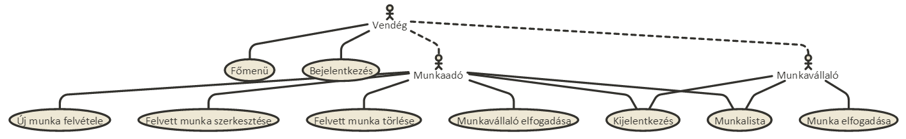
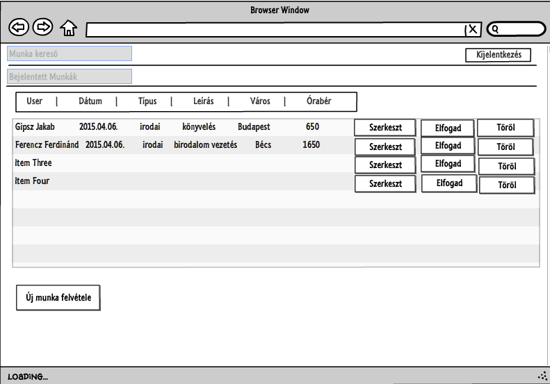
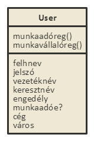
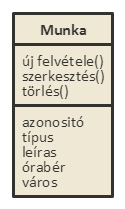
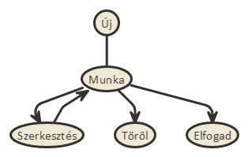

# Beadando
<h1>Alkalmazások fejlesztése első beadandó</h1>

<h3>Késíztette: Lévai András</h3>
<h5>Nemptun: AGY276</h5>
<h5>email: levaiandrass@gmail.com</h5>

### __Követelmény__ __analízis__

###### 1. Funkciók és elvárások
        Alkalmazások fejlesztése órára egy olyan programot kellett készíteni mely a node js-t 
    felhasználva képes adatokat tárolni, új adatokat felvinni, meglévőket szerkeszteni 
    vagy törölni azokat. 
        Elvárás volt még egy autentikációs folyamat is, melyben egy regisztrált személy
    csak akkor haszánlhatja  programot/léphet be az oldalra, ha adatai megfelelnek
    és szerepel az adatbázisban.

###### 2. Használatieset-modell
        i. Szerepkörök : Két fajta felhasználó a munkaadó és a munkaválalló, szerepkörüket
    tekintve a munkavállaló jobban lekorlátozott az alkalmazás funkciójaival szemben.
    
        ii. Használati útmutató a két felhasználó modellhez:  Az alkalmazásban két fajta
    felhasználó elérhető, a munkaadó és a munkavállaló.
    A munkaválallók lehetőségei korlátozzok, nekik csak meghirdetett munkák megtekin-
    tésére és azokra való jelentkezésre van lehetőségük (ha a munka szabad). A munka-
    adó ezzel ellentétben felvehet új munkát, szerkesztheti, törölheti azokat és el is
    fogadhatja, ha egy munkavállaló jelentkezett a munkára. Ennél a modellnél mindösz-
    sze annyi megkötés van, hogy nem fogadhat el munkát valamint más munkaadó feladott
    munkáját értelem szerűen nem szerkesztheti/törölheti.
    
        iii. Folyamat diagramm és a Munkavállaló modell kifejtése.
    A bejelnetkezés oldalra érkezve eldönthetjük milyen típusú felhasználót szeretnénk 
    regisztrálni. Jelen esetben vegyük a munkavállalót, hiszen ő kevésbé lekorlátozott
    szerepkört tölt be. A regisztrációs oldalon meg kell adnunk vezeték és keresztnevünk
    , felhasznlói nevünk, jelszót, valamint lehetőségünk van céget és várost megadni, de
    ezeket az alkalmazás nem várja el, így üresen is hagyhatjuk őket, ha szereretnénk.
    Regisztráció után, sikeres bejelentkezéssel a feladott munkák listája fogad minket.
    Itt a bal alsó sarokban található gombal felvehetünk egy új munkát. Ezután átkerülünk
    a munka felvételének az oldalára. Itt meg kell adnunk kötelező módon a várost amely-
    ben a munkát hirdetjük, a típusát (például fizikai vagy irodai), egy rövid leírását
    és az órabért. Ha ezt sikeresen megadtuk ismét visszakerülünk a munkák listáját meg-
    jelenítő oldalra, ahol már meg fog jelenni az imént felvett munkánk is. Ez után lehe-
    tőségünk lesz szerkeszteni vagy törölni a feladott munkát. Törlés esetén az alkalmazás 
    egyszerűen csak törli az adatbázisból az információkat. Szerkesztés esetén egy újabb
    oldalra jutunk, ahol a korábban feladott munka bármely tulajdonságát szabadon változ-
    tathatjuk (olyan megkötésekkel mint például, hogy az órabér csak szám lehet). Nem
    muszáj minden adatot módosítanunk vagy újra beírnunk csak azokat melyeket ténylegesen
    változtazni szeretnénk. A harmadik gomb akkor válik számunkra elérhetővé, ha egy 
    munkavállaló jelentkezett egy munkára. Ezután mi elfogadhatjuk ezt és így a munka
    betöltötté válik.
    
     

### __Tervezés__

##### 1.Architektúra terv
    i. Oldaltérkép
            Publikus:
                - Főoldal
                - Regisztráció
                -Bejelentkezés
            Munkaválalló
                -Főoldal
                -Bejelentkezés/Kijlentkezés
                -Munkalista
                -Munka elfogadása
            Munkaadó
                -Főoldal
                -Bejelentkezés/Kijlentkezés
                -Új munka felvételez
                -Felvett munka szerkesztése
                -Felvett munka törlése
                -Munkaadó jelentkezésének elfogadása
                
    ii. Végpontok
            * POST /: Főoldal
            * GET /signup: Átirányítás munkaadó regisztrációs oldalra
            * POST /signup: Munkaadó regisztráció ellenőrzés és mentése
            * GET /signupemp: Átirányítás munkavállaló regisztrációs oldalra
            * POST /signupemp: Munkavállaló regisztrácó ellenőrzése és mentése
            * GET /munkalista: Munkák listájának a megjelenítése
            * POST /munkalista: Kiemelt munka szerkesztési oldalára irányít át
            * POST /elfogad: Munkavállaló regisztrálása egy betöltetnen munkáhozz
            * POST /torol: Kijelölt munka törlése
            * GET /felvesz: Új munka felvételéne az oldalára átirányítás
            * POST /felvesz: Új munka felvétele és adatok ellenőrzése
            * GET /szerkeszt: Munka szerkesztési oldalának a megjelenítése
            * POST /szerkeszt: Szerkesztett munka mentése
            * GET /delete: Munka törlése
            * GET /jovahagy: Munkavállaló jelentkezésének elfogadása
            
##### 2. Felhasználói felület modell
    i. Hibalista vázlat

         
##### 3.Osztálymodell
    i. User modell:

    
    ii. Munka modell:

    
    iii. Állapot diagramm:

### Implementáció
###### 1. Fejlesztői környezet
        Az alkalmazás a cloud9 (c9.io) segítségével készült. A designról a Bootstrap
    gondoskodik. A kód közzététele a Githubon törént a program pedig a Heroku-n lett
    szimulálva.

###### 2. Könyvtárstruktúra
    Modellek:
        1.  User modell:
                A user modell tárolja a felhasználók adatait. Minden felhasználó rendelkezik
            vezeték és keresztnévvel, azonosítóval, jelszóval, egy tulajdonsággal hogy munkaadók vagy
            munkavállalók e, egy boolean típusú 'isMunkaado' értékkel, ami eldönti róluk hogy miylen 
            típúsuak (ennek értéke alap állapotba false, de amikor munkavállalóval regisztrálunk akkor 
            ennek értéke true lesz). Emellet a munkavállalói regisztrációks űrlapon megadható egy cég
            név is és egy város név, de ezek opcionálisak csak.
                    
        2.  Munka modell: 
                Itt tároljuk a munkának a tulajdonságait. Minden munka rendelkezik egy azonosítóval,
            amely egy 10-99 közötti száma, értékét pedig egy random szám generátor állítja be.
            Emellett a munkaadóknak meg kell adniuk a munka típusát, leírását,órabérét valamint a
            várost ahol a munkát ajánlják.
        
    Controllerek:
        1.  index.js: 
                Egy egyszerű controller, ami a főoldalért felel, ki és be jelentkezési funciói vannak.
                    
        2.  login.js:
                A login három úttal rendelkezik, egy a bejelentkezésért felel, a másik kettő pedig a 
            munkavállalói és a munkaadói űrlapokkal és az azon felvett adatokkal foglalkozik. 
            A tényleges bejelentkezés vizsgálatát azonban a "server.js" fájl intézi.
                    
        3.  munka.js:
                Ez a controller jeleníti meg a munkák listáját, melyek táblázatba vannak elhelyezve.
            A felhasználó erre az oldalra érkezik bejelentkezés után és innen mehet tovább
            a többi opcióra.
                    
        4. szerk.js:
                Az alkalmazás legfontosabb része. Ez az út zárt a munkavállalók számára, hiszen ők le
            vannak korlátozva, nem vehetnek fel munkákat, így nem is szerkeszthetik vagy törölhetik azokat.
            A munkaadók végrehajthatják az imént említett funkciókat, azonban rájuk is vonatkoznak megkötések.
            Más munkaadó felhasználó által létrehozott munkákat nem módosíthatnak/törölhetnek.
            
    Public:
        Az alkalmazás alatt a Bootstrap "sueprhero" sémája fut.
    
    Views:
        1.  index: Az index controller megjelenítése.
                    
        2.  login: Három oldallal rendekezik. 
            1.  Az "index" a főoldal, itt lehet bejelentkezni, valamint kiválasztani milyen
            szerepkörbe szeretnénk regisztrálni magunkat. Hozzá tartozik egy "post" metódus.
                                                        
            2.  A "signup" a munkaadók regisztrációjának a sablonját tartalmazza. 
            Hozzá tartozik egy "get" és egy "post" metódus.
                                                        
            3.  A "signupemp" a munkavállalók regisztrációjának sablonját tartalmazza.
            Hozzá tartozik egy "get" és egy "post" metódus.
                    
        3.  munkak : Két oldallal rendelkezik.
            1.  Az "elfogad" csak egy egyszerű, üres hbs, mindössze azt a cél szolgálja, 
            hogy egybmunkavállaló elfogadjon egy adott munkát, ezzel megváltoztatva a
            munka státuszát. Hozzá tartozik egy "post" metódus.
            
            A "munkalista" szerepe a munkák, azoknak a tulajdonságai, valamint a gombok
            megjelenítése, melyekke a felhasználó közlekedni tud az oldalon. 
            Hozzá tartozik egy "get" és egy "post" metódus.
                                                        
        4.  munkak_ado : Három oldallal rendelkezik.
            1.  A "delete" egy üres oldal, amely egy adott munka törléséért fele. 
            Hozzá tartozik egy "get" metódus.
            
            2.  A "felvesz" az új munka felvételének a sablonját tartalmazza. 
            Hozzá tartozik egy "get" és egy "post" metódus.
            
            3.  A "szerkeszt" a munkák szerkesztésének a sablonját tartalmazza. 
            Hozzá tartozik egy "get" és egy "post" metódus.
            
    Workspace:
        1. package.json: A modulokat valamint a tesztek futtatásáért felelős.
        2. README.md: A dokumentációt tartlamazza
        3. server.js: A szerver indításáért felel. Itt ellenőrzi az alkalmazás a különböző
        szerepköröket valamint a jogosultságokat.

### Tesztelés
###### 1. Tesztelési környezet 
        A teszteléshez két modult használtam, a zombie-t, amellyel  a végpontok elérését, 
    valamint a funkciókat teszteltem és a moccha-t, mely a modellek tesztelésében segédkezett.

###### 2. Egységteszt, user modell  
        A moccha segítségével a test mappában található munkaado.test.js teszteli az alkal-
    mazást mind a munkavállaló mind pedig a munkaadó regiisztrációjára, az újonnan felvett
    felhasználók prezisztálását az adatbázisban, a hibásan megadott adatok jelzése valamint a
    bejelentkezést és a jelszó validációt is.
###### 3. Funkcionális felületi tesztek
        A zombie.js segítségével lett tesztelve az alkalmazás funckió. ellenőrzi, hogy adott
    útvonalakon megfelelő helyre jut-e el a program (megfelelő végpontokba) emellett ellenőrzi
    még az új munka felvételét is és az adatok hiányának hibáit. Itt fontos megjegyezni, hogy a
    test által megszabott alap 200ms várakozási idővel a teszt hibát dob ki, de ha a timeout 
    kicsit megemeljük a teszt már probléma nélkül lefut.
    
### Felhasználói dokumentáció
###### 1. A futtatáshoz ajánlott konfiguráció:
        Az alkalmazás probléma mentesen működik a nagyobb böngészőkön mint például az Internet
    Explorer, Chrome vagy Firefox.
[Az alkalmazás elérhetősége](https://leandras.herokuapp.com/)

###### 2. A telepítés lépései:
        Az alkalmazás kódja és mappa struktúrája lementhető github-ról, közvetlen klónozva
    HTTPS: https://github.com/Leandras/Beadando.git
    SSH: git@github.com:Leandras/Beadando.git
    Subversion: https://github.com/Leandras/Beadando

###### 3. A program használata
         Mikor először megnyitjuk az oldalt, a főoldal fogad. Itt a jobb felső sarokan 
    kattinthatunk a bejelentkezésre, ami átírányít minket a következő oldalra.
    
        Ha még nem vagyunk regisztrálva, úgy itt eldönthetjük milyen szerepkörbe
    szeretnénk csatlakozni az oldalhoz. Két gomb áll a rendelkezésünkre 
    "Munka vállaló rgisztráció" és "Munkaadó regisztáció". Regisztráció 
    folyamán az elvárt információk a felhasználó név, jelsó, vezetéknév 
    és keresztnén. Emelett a munkaadóknak lehetőségük van cégként is beregisztrálni
    és székhelyük városát is megadni, de ez csak opcionális elvárás.
    
        Ha megtörtént a regisztráció, úgy bejeltnekezve a belső főoldal fogad
    minket, melyen a feladott munkák listáját láthatjuk. Ha munkavállalóként
    léptünk be, itt csak arra van lehetőségünk hogy böngésszünk a munkák között 
    és ha találunk számunkra szimpatikusat, amely szabad is, úgy arra 
    regisztrálhatjuk magunkat.
        Ha munkaadóként vagyunk jelen az oldalon, alkalmunk nyílik új munka
    felvételére, vagy ha már korábban adtunk fel munkát, azt szerkezhetjük,
    törölhetjük vagy ha jelentkezett rá már munkavállaló úgy el is fogadhatjuk
    a jelentkezését. Természetesen más által feladott munkát nem módosíthatjuk
    valamint el sem fogadhatunk munkát, azt csak munkavállalók tehetik. 
        Új munka felvételekor meg kell adnunk a várost, amelyben a munkát hir-
    detjük, a típusát, mint például fizikai vagy irodai, egy rövid leírást a 
    munkáról, legvégül pedig az órabért. Miután feladtuk a munkát, szerkezhetjük
    utólag is ezeket a paramétereket.
